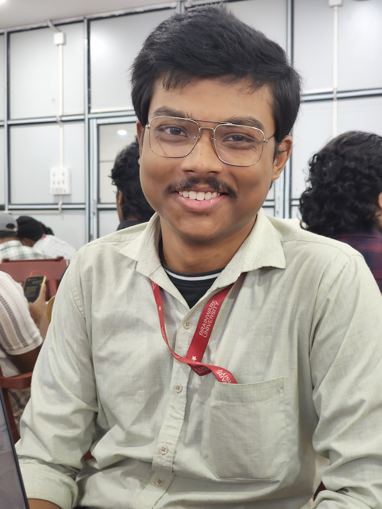

 

### 👋 Hello World! 

I'm @Butter aka Aritra Malik, a passionate Python programmer based in India. My journey in the world of coding began with my uncle who was studying in a college at that time.
He used to make some awesome projects on his own, and I used to just watch with amazement and excitement. He taught me the basics of logic and some basic C syntax. And now I'm walking in his footsteps. I'm really happy that got to meet my awesome uncle. 

🚀 **About Me:**
- 💻 I specialize in C [It was in the school curriculum], Python[Self taught], PyTorch[Self taught]
- 🤖 Can work in tools like ChatGPT, Claude, Perplexity, Gemini with efficient prompts, and working with Agentic Workflows.
- 🌐 Exploring the subjects of the working of human brain.
- 📚 Currently learning JavaScript
- 🎨 Loves to draw as a hobby.

📰 **Achivements:**
- Won Smart India Hackathon, 2024 as a junior fullstack dev in NextGen Experts Team

🎨 **Hobbies:**
- Coding and building cool projects.
- Drawing if I'm bored.
- Exploring new technologies.
- Competing in eSports Tournaments.
- Reading tech or gaming news.

📫 **Get in Touch:**
- Telegram: @[Aritra Malik](https://t.me/aritra_malik)

🤝 **Let's Collaborate:**
- 👀 Always open to interesting projects and collaborations!

📈 **GitHub Stats:**

Thanks for visiting! Feel free to explore my repositories and don't hesitate to reach out. Happy coding! 🚀
